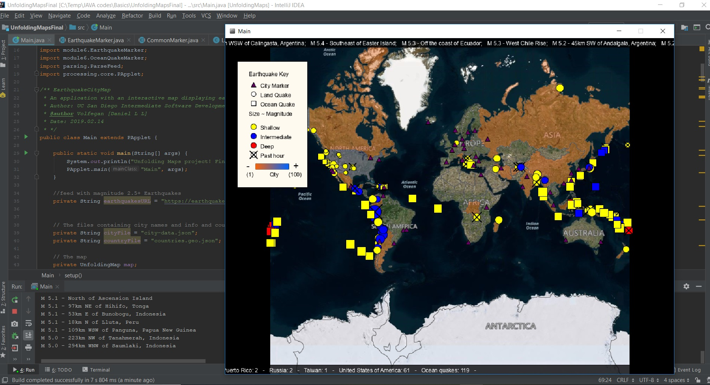

# QuakeMap

Course Name: Object Oriented Programming in Java

Descriptions: Online course offered by University of San Diego through Coursera.

The final project is just a map that shows some current Earthquakes, their intensity, location. The visualization colour the countries according with how many quakes they have and a scroll ticker shows the top stronger quakes and quantity for each country.

In here I learned that JAVA can be complicated to do something I can do much easier on Python or HTML/CSS/Javascript. The course pushes Eclipse IDE, but I used IntelliJ IDEA, so my folder structure might be a bit different from the standard of the course.
I didn't like this course. The way Duke University was teaching JAVA was much better than this one from University of San Diego. If you are doing the specialization, the next course from University of San Diego is a bit better than this one, so just bear and finish. If you are thinkig in doing this course solo, try another one because this course will make you hate JAVA if you are not hating already.

The course compresses in using the Eclipse IDE (which I didn't use), learning Processing in a IDE and UnfoldingMaps (that is not being maintained). So basically you are doing a project that will stop work because Processing is evolving, but not the dependencies the course force you to use.

What I learned from this course:

                    _______________________
                   / Never use JAVA
                  / for data visualization!
                 /-------------------------
        _  ,/|  /
       '\`o.O'   _
        =(_*_)= (
          )U(  _)
         /   \(
    ____(/`-'\)____
